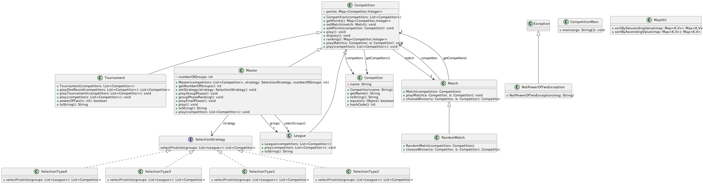

# L3 MIAGE | Projet de COO

---
# Auteur

- [Patricia TOTOUM](mailto:patricia.totoummandoum.etu@univ-lille.fr)

---
# Sujet et délais

### [Le sujet](https://www.fil.univ-lille.fr/~quinton/coo/projet/competitionsV3.pdf)

| Livrable   | Travail à réaliser                          | Échéance   |
|:-----------|:--------------------------------------------|:-----------|
| Livrable 1 | Conception de la version 1 de l'application | 09/10/2022 |
| Livrable 2 | Conception de la version 2 de l'application | 13/11/2022 |
| Livrable 3 | Conception de la version 3 de l'application | 11/12/2022 |

# Sommaire
Journal de bord (Semaine) : [1](#semaine-1) [2](#semaine-2) [3](#semaine-3) [4](#semaine-4) [5](#semaine-5) [6](#semaine-6) [7](#semaine-7) [8](#semaine-8) [9](#Semaine-9) [10](#Semaine-10) [10](#Semaine-10) [11](#Semaine-11) [12](#Semaine-12) [13](#Semaine-13) 

---
# Rubrique HowTo

### Récupération des sources du projet
Depuis votre terminal, veuillez exécuter la commande suivante :
- `git clone git@gitlab-etu.fil.univ-lille.fr:patricia.totoummandoum.etu/projet_totoum_patricia_coo.git`

**Ensuite, Veuillez exécuter les commandes suivantes dans un terminal à partir du dossier racine du projet :**

### Compilation des fichiers sources
- `make classes`

### Exécution du programme
- `make execute`

### Création de l'archive exécutable
- `make archive`

### Exécutions du jar
- `make jar`

### Compilation et exécution des tests
- `make tests`

### Génération de la documentation
Le dossier doc/ se trouvera à la racine du projet.
- `make doc`

---
# Livrables

## Livrable 1

---
## Livrable 2

---
## Livrable 3

---
# Journal de bord

## Semaine 1
Lecture, compréhension du sujet et réflexion sur différents choix possibles de conception.

### Objectifs à venir :
- [x] Relire les leçons sur les tests, Mock.
- [x] Relire les cours de programmation orientée objet.

---
## Semaine 2
- [x] Creation d'un premier diagramme UML en vue d'une génération du squelette du projet. Le diagramme pourra évoluer en fonction des besoins de conception.

### Objectifs à faire pour la prochaine semaine :
- [x] Faire les tests des classes Match et League
- [x] Commencer les tests de la classe Tournament

---
## Semaine 3

### Objectifs à faire pour les 2 prochaines semaines :
- [x] Coder les classes Competition, Match, Competitor, CompetitionMain
- [x] Terminer les tests de Tournament

---
## Semaine 4
- [x] Coder les classes League et Tournament, TournamentTest.

---
## Semaine 5
- [x] Vérifier que tout le code fonctionne, que les tests sont tous validés, que les principes de conception et l'application des design patterns sont respectés.

### [Premier Livrable](#livrable-1)

### Explication des choix de conception :

- Des difficultés pour comprendre ce que représente un match. Pour respecter le principe OCP, Match est une classe abstraite, afin de pouvoir définir plus tard de nouveaux types de matchs.
- Dans ma première conception, un joueur était défini par son nom et son nombre de points. Problème : comment faire si le compétiteur participe à plus d'une compétition? Solution retenue : on crée une table de hachage qui répertorie le nombre de points de chaque joueur. Les points seront gérés par la compétition.
- La méthode play(List<Competitor>) de la classe Tournament a d'abord été faite récursivement. Je crée une liste de joueurs qui va contenir les gagnants de chaque tour. Je leur fais jouer un premier tour. Puis récursivement, j'invoque la méthode play(List<Competitor>) sur la liste de gagnants du tour précédent. Cette version fonctionnait mais était longue et comportait une cascade de "if".
Ensuite j'ai fait une nouvelle version avec une boucle "Tant que" qui remplaçait les conditions précédedentes. Celle-ci était plus lisible mais toujours longue.
La version finale respecte les principes de responsabilité unique et KISS. J'ai délégué certains comportements à d'autres méthodes. Ce qui rend le code plus compréhensible, facilement extensible.
- Pour les classes de tests, j'ai fait des Mock(MockLeague, MockTournament et MockMatch). Ensuite j'ai fait les tests des classes correspondantes, soit les tests des sous-classes de Competition. Cependant, le code de MockLeague et MockTournament est le même à un détail près. Ce qui fait une répétition de code et ne respecte pas le principe DRY. J'ai ensuite essayé de factoriser mon code en faisant un MockCompetition. Mais c'était difficile après de trouver les liens d'héritages entre les classes de tests ainsi que ce qu'il fallait tester. Dans les versions suivantes, avec la pratique, il n'y aura plus cette répétition de code.

---
## Semaine 6
Lecture, compréhension du sujet du deuxième livrable et réflexion sur différents choix possibles de conception.

### Avant de commencer :
- [x] Relire les leçons sur les Design Patterns.
- [x] Amélioration du Makefile.
- [x] Amélioration des tests du livrable 1.
- [x] Coder l'interface SelectionStrategy.

---
## Semaine 7
- [x] Creation d'un premier diagramme UML modélisant les Masters et les "Strategy". Le diagramme pourra évoluer en fonction des besoins de conception.
- [x] Coder les deux premières stratégies, SelectionType1 et SelectionType2.
- [x] Commencer les tests des stratégies.

---
## Semaine 8
- [x] Commencer la classe Master jusqu'au classement des poules.
- [x] Coder deux autres stratégies, SelectionType3 et SelectionType4.
- [x] Terminer les tests de toutes les stratégies.

---
## Semaine 9
- J'ai pris un peu de retard cette semaine car mon ordinateur personnel s'est abîmé. C'était très compliqué travailler à distance avec la connexion au M5 qui est très lente.
- [x] Coder la finale du  Master.
- [x] Modification de l'implémentation. Créer une classe GroupPhase pour la phase de poule et mettre le code présent dans Master dans cette nouvelle classe. Le Master doit fonctionner comme avant. 
- [x] Faire les tests de la classe GroupSage.
- [x] Vérifier que tout le code fonctionne, que les tests sont tous validés, que les principes de conception et l'application des design patterns sont respectés.

### [Deuxième Livrable](#livrable-2)

### Explication des choix de conception :

- J'ai utilisé le Design Pattern Strategy pour coder la classe Master. La méthode de sélection des finalistes d'un Master étant différente d'un Master à l'autre, j'ai fait quatre classes de stratégies de sélections, qui implémentent toutes une interface SelectionStrategy. Lors de la création d'un master, la stratégie voulue sera passée en argument du constructeur. J'ai respecté le principe OCP. Le code est ouvert aux extensions, pour faire un nouveau type de Master, il suffit de créer une nouvelle classe qui implémente l'interface ci-dessus et définir une méthode de sélection. Les classes Master et GroupStage n'ont pas besoin d'être modifiées.
- Au départ, la phase de poule était jouée dans le Master. Cela fonctionnait très bien ainsi. J'ai décidé plus tard de séparer mon code pour respecter le principe de responsabilité unique, en faisant une classe GroupStage dédiée à la phase de poule. J'ai reporté le code qui était dans la classe Master dans la nouvelle classe GroupStage. Quelques modifications ont été faites pour synchroniser les deux phases. Tout fonctionne comme prévu.

---
## Semaine 10
Lecture, compréhension du sujet du troisième livrable et réflexion sur différents choix possibles de conception.

- [x] Lire les documents sur le Design Pattern Observer.
- [x] Coder l'interface MatchObserver
- [x] Compléter la classe AbstractMatch.

---
## Semaine 11
- [x] Faire la classe BookMaker.
- [x] Faire la classe Reporter.
- [x] Améliorer les tests du livrable 2 avec l'héritage dans les tests et des Mocks.(Vous pouvez consulter le code des classes de tests.)

---
## Semaine 12
- [x] Faire un package displayer dans lequel se trouvent les classes qui gèrent les affichages.
- [x] Améliorer le Main, les affichages et les commentaires des observateurs.
- [x] Terminer les tests sur les observateurs dans le package test.observer. Dans le package test.competition, tester que pour chaque compétition, les observateurs sont notifiés à chaque match joué.

---
## Semaine 13
- [x] Vérifier que tout le code fonctionne, que les tests sont tous validés, que les principes de conception et l'application des design patterns sont respectés.

### [Troisième Livrable](#livrable-3)

### Explication des choix de conception :

- J'ai utilisé le Design Pattern observer pour la version 3 du projet. Ici, l'observable est la classe AbstractMatch et les observateurs sont des journalistes et des bookmakers. On a une interface MatchObserver, dans laquelle est déclarée une méthode reactToMatch(Competitor a, Competitor b). Les classes Reporter et BookMaker implémentent l'interface MatchObserver. Ces dernières définissent chacune la méthode reactToMatch. En particulier, les journalistes commentent le match en disant le vainqueur et le perdant. Les bookmakers commentent le match en mettant à jour les cotes de chaque compétiteur en fonction des victoires et des défaites.
- Au fur et à mesure du projet, j'ai eu plusieurs conceptions pour gérer les affichages des observateurs. En effet, je voulais que des observateurs différents aient des messages différents. D'abord, j'ai fait des classes abstraites Reporter et BookMaker, comportant une template méthode reactToMatch, puis des sous-classes de journalistes et de bookmakers qui concrétisaient la méthode abstraite display(Competitor a, Competitor b) avec des commentaires différents. Ensuite, j'ai utilisé le Design Pattern decorator. Ces implémentations fonctionnaient mais n'étaient pas satisfaisantes car ça faisait une cascade de sous-classes à chaque fois qu'il faut de nouveaux observateurs.
- Pour terminer, j'ai défini une abstraction Displayer pour les afficheurs. Puis des classes concrètes qui implémentent cette interface. Puis je fais dépendre les observateurs de Displayer. Le principe "Dependency Inversion Principle" est respecté.
- J'ai amélioré les tests du livrable 2 et ajouté tous les tests du livrable 3.

---
